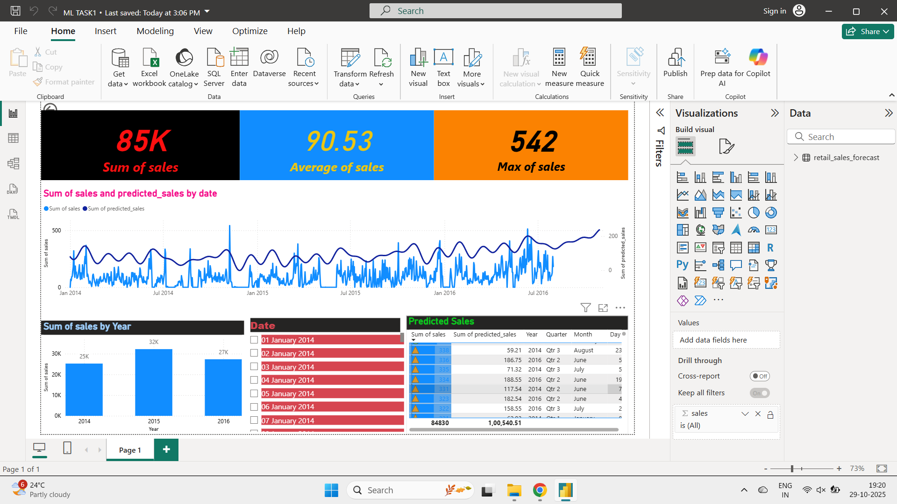
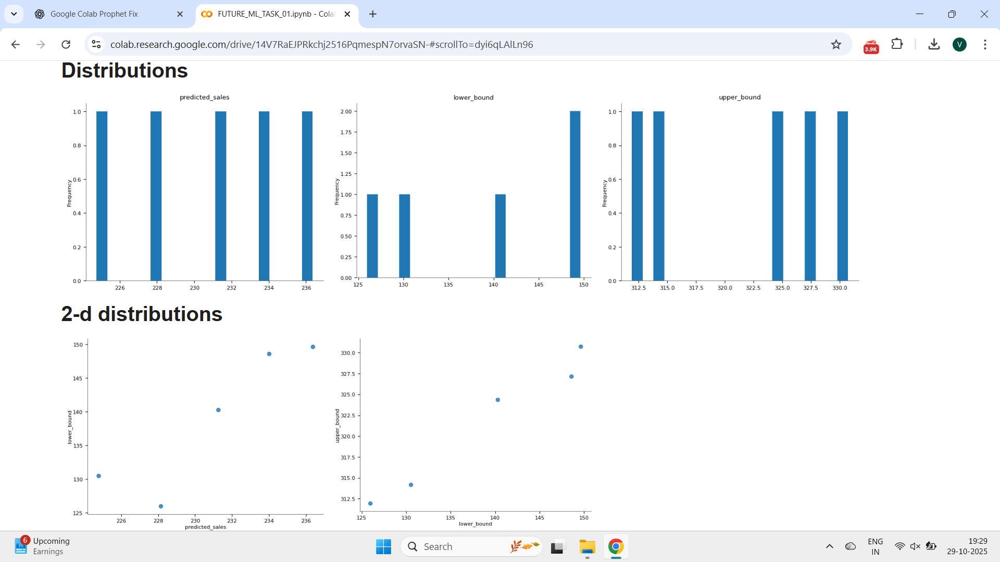
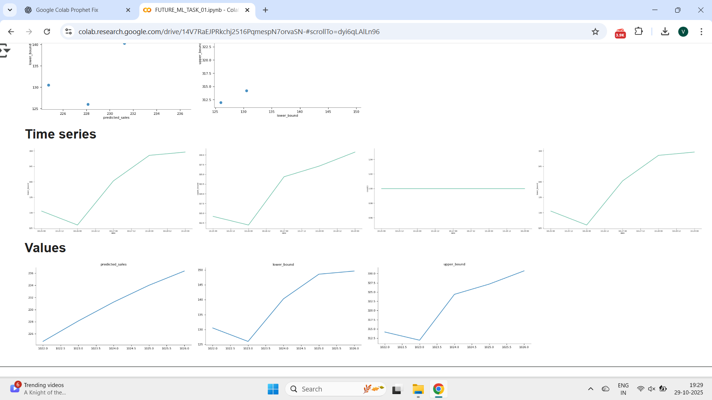

# 🚀 FUTURE_ML_01 — AI-Powered Sales Forecasting Dashboard

This repository contains **Task 1** of the **Future Interns Machine Learning Internship**.  
The goal of this task is to build a forecasting model that predicts future sales trends using Python’s **Prophet** library and visualize the results in **Power BI**.

## 🧠 Task Overview
Task Name: AI-Powered Sales Forecasting Dashboard  
Objective: Predict future sales using time-series forecasting.  
Track: Machine Learning (Track Code: ML)

### 🔹 Key Deliverables
- Time-series forecasting model using **Prophet**  
- Visualization of **predicted trends, seasonality, and forecast**  
- Interactive **Power BI Dashboard** showing actual vs predicted sales  

---

## 📁 Files Included

| File Name | Description |
|------------|-------------|
| `FUTURE_ML_TASK_01.ipynb` | Colab notebook containing Prophet code and forecast generation |
| `retail_sales_forecast.csv` | Output CSV used in Power BI |
| `AI_Sales_Forecast_Dashboard.pbix` | Power BI dashboard file |
| `prophet_forecast.png` | Prophet main forecast plot |
| `prophet_components.png` | Prophet trend and seasonality components |
| `powerbi_sales_dashboard.png` | Screenshot of Power BI dashboard (preview) |

---

## 🛠️ Tools & Technologies
- **Python (Prophet, Pandas)**
- **Power BI**
- **Google Colab**
- **GitHub**

---

## 📊 Power BI Dashboard Preview
.png)

---

## 🔮 Prophet Forecast Visuals
| Forecast Plot | Components |
|---------------|-------------|
|  |  |

---

## 🏁 Summary
✅ Built a forecasting model using Prophet  
✅ Visualized future trends in Power BI  
✅ Completed as part of Future Interns Machine Learning Internship (Task 1)

---

---

